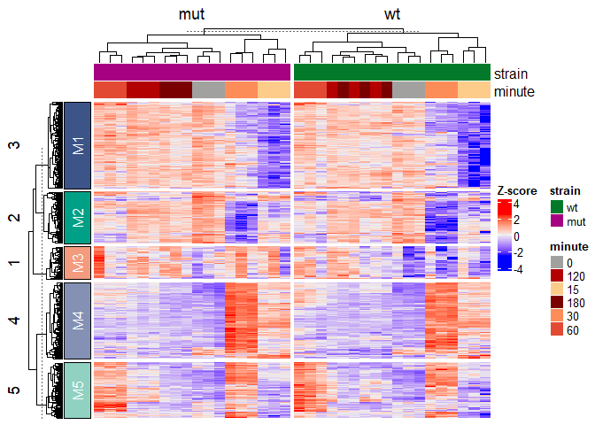
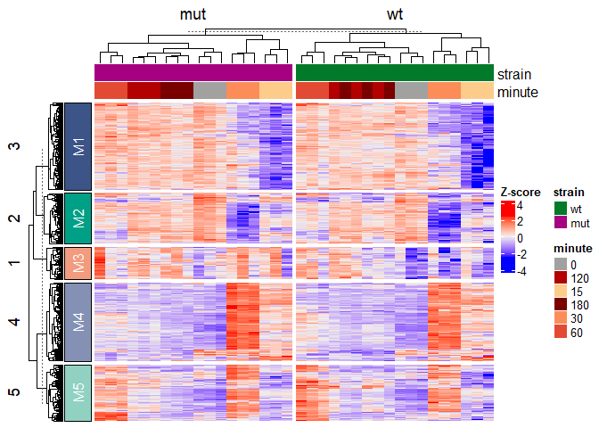

<!-- README.md is generated from README.Rmd. Please edit that file -->

# ADS8192 Heatmap Package

<!-- badges: start -->

<!-- badges: end -->

This package provides tools for analyzing RNA-seq data from the fission
yeast stress response experiment. It includes functions to do the
following: - Normalize count data - Select top variable genes - Scale
expression matrices - Generate annotated heatmaps - Extract gene
modules - Export results

## Installation

You can install the development version of ADS8192 from
[GitHub](https://github.com/) with:

``` r
remotes::install_github("akaur40/ADS8192")
```

## Quick Start Guide

``` r
devtools::load_all()
#> ℹ Loading ADS8192
#> Warning: package 'testthat' was built under R version 4.5.3

#load example data
data("example_se", package = "ADS8192")

#Run full analysis
result <- run_heatmap_analysis(example_se)
```



``` r

#view output
result$heatmap
```


``` r
head(result$scaled_matrix)
#>               GSM1368273 GSM1368274 GSM1368275 GSM1368276 GSM1368277 GSM1368278
#> SPAC22A12.17c -1.1864909 -1.3880733 -1.0590725  0.3785982  0.3669586  0.3461664
#> SPAC23H3.15c  -1.5360323 -1.5247699 -1.4243292  0.7333195  0.6714982  0.7086884
#> SPBC660.05    -0.7029685 -0.9057978 -1.0368268  1.4941974  1.4451379  1.3242475
#> SPBC24C6.09c  -1.2567151 -1.6338357 -1.0598001  0.6513957  0.5396933  0.6287619
#> SPCPB16A4.07  -1.1419400 -1.1888846 -0.8287633  1.1583026  1.0744403  1.1173947
#> SPACUNK4.17   -1.7518472 -1.6130182 -1.5457258  0.6310616  0.6099901  0.8421375
#>               GSM1368279 GSM1368280 GSM1368281  GSM1368282 GSM1368283
#> SPAC22A12.17c   1.352677   1.366316  1.2542975  0.88339776  1.2994821
#> SPAC23H3.15c    1.630368   1.490610  1.4910764 -0.07701231  0.4548246
#> SPBC660.05      1.083546   1.280595  0.9211262 -0.80380980 -0.4477036
#> SPBC24C6.09c    1.596357   1.802446  1.7834487 -0.09514019  0.1436727
#> SPCPB16A4.07    1.600163   1.412343  1.4395206 -0.74121317 -0.3242169
#> SPACUNK4.17     1.416190   1.618818  1.6237901  0.10391214  0.3977222
#>                GSM1368284 GSM1368285 GSM1368286  GSM1368287 GSM1368288
#> SPAC22A12.17c  1.07855946 -0.4179828 -0.9785400 -0.45948470 -0.7012123
#> SPAC23H3.15c   0.06047980 -0.1973807 -0.6532320 -0.14474227 -0.4767343
#> SPBC660.05    -0.70025857 -0.5450986 -0.9423990 -0.66553952 -0.5110332
#> SPBC24C6.09c  -0.01649839 -0.1515764 -0.6797619  0.16910754 -0.4277256
#> SPCPB16A4.07  -0.44082243 -0.6484098 -0.8237513 -0.49628983 -0.6378668
#> SPACUNK4.17    0.23527873 -0.2259985 -0.5902900 -0.00399393 -0.3811920
#>                GSM1368289 GSM1368290 GSM1368291 GSM1368292 GSM1368293
#> SPAC22A12.17c -0.36945407 -0.9931303  -1.563694 -1.1973840 -0.8405493
#> SPAC23H3.15c  -0.09703858 -0.6210459  -1.769388 -1.8006570 -1.1043135
#> SPBC660.05    -0.56176956 -0.7142573  -0.875045 -0.9518366 -0.7673312
#> SPBC24C6.09c   0.06330341 -0.4184963  -1.764191 -1.8295729 -0.9452545
#> SPCPB16A4.07  -0.50126088 -0.7657615  -1.035099 -0.8843954 -0.7730759
#> SPACUNK4.17   -0.07040929 -0.2303600  -1.704993 -1.7876849 -1.2224015
#>               GSM1368294 GSM1368295 GSM1368296 GSM1368297 GSM1368298 GSM1368299
#> SPAC22A12.17c  0.3379515  0.1810043  0.3087035   1.340804   1.339124   1.495134
#> SPAC23H3.15c   0.7199094  0.5771376  0.6766638   1.577005   1.604713   1.712067
#> SPBC660.05     1.4196689  1.5387403  1.4802159   1.270635   1.734433   1.427626
#> SPBC24C6.09c   0.6164783  0.2969390  0.5111977   1.669006   1.618457   1.783226
#> SPCPB16A4.07   1.1437514  1.1349075  1.2030549   1.525374   1.748155   1.723888
#> SPACUNK4.17    0.6292054  0.4655715  0.6848970   1.505640   1.509102   1.652976
#>                GSM1368300  GSM1368301  GSM1368302 GSM1368303   GSM1368304
#> SPAC22A12.17c  0.97878915  1.00343989  1.01213036 -0.8194060 -0.642470958
#> SPAC23H3.15c  -0.07152756  0.05550987 -0.13537629 -0.2604829 -0.145909019
#> SPBC660.05    -0.76660286 -0.30714728 -0.80324935 -0.5481045 -0.526983138
#> SPBC24C6.09c  -0.39093121 -0.28807988 -0.28966004 -0.2427539 -0.004653822
#> SPCPB16A4.07  -0.58346285 -0.56277673 -0.54331478 -0.4230782 -0.443120352
#> SPACUNK4.17   -0.15779208  0.08731675 -0.06715894 -0.4646406 -0.138070992
#>               GSM1368305 GSM1368306 GSM1368307 GSM1368308
#> SPAC22A12.17c -0.7132849 -1.0772390 -0.7944650 -1.1216001
#> SPAC23H3.15c  -0.1187138 -0.6302985 -0.6844109 -0.6904754
#> SPBC660.05    -0.5542182 -0.5074658 -0.7841647 -0.4905582
#> SPBC24C6.09c  -0.2386738 -0.7578405 -0.6742784 -0.7080500
#> SPCPB16A4.07  -0.4275396 -0.6734949 -0.7244871 -0.6682695
#> SPACUNK4.17   -0.2921440 -0.4960274 -0.6859754 -0.5838842
result$gene_modules
#>                gene module
#> 1     SPAC22A12.17c     M5
#> 2      SPAC23H3.15c     M4
#> 3        SPBC660.05     M4
#> 4      SPBC24C6.09c     M4
#> 5      SPCPB16A4.07     M4
#> 6       SPACUNK4.17     M4
#> 7        SPBC839.06     M4
#> 8      SPBC16E9.16c     M4
#> 9        SPAC139.05     M4
#> 10      SPBC1289.14     M5
#> 11      SPAC19D5.01     M4
#> 12      SPAC1002.19     M5
#> 13      SPCC794.04c     M4
#> 14     SPBC2F12.09c     M4
#> 15      SPBC21C3.19     M4
#> 16    SPAC32A11.02c     M4
#> 17     SPAC1002.17c     M5
#> 18      SPCC757.07c     M4
#> 19      SPAC4H3.03c     M4
#> 20     SPAC27D7.09c     M5
#> 21       SPAC637.03     M4
#> 22     SPAC15E1.02c     M5
#> 23      SPBC8E4.01c     M2
#> 24     SPAPB1A11.03     M5
#> 25      SPAC186.05c     M2
#> 26      SPBC365.12c     M4
#> 27     SPBC1105.13c     M4
#> 28      SPAC22F8.05     M4
#> 29     SPNCRNA.1165     M4
#> 30      SPAC1F8.03c     M2
#> 31      SPAC19A8.16     M4
#> 32      SPCC1322.08     M4
#> 33    SPBC11C11.06c     M4
#> 34    SPCC16A11.15c     M4
#> 35       SPBC725.03     M4
#> 36      SPBC1105.14     M4
#> 37      SPAP8A3.04c     M5
#> 38      SPBC106.02c     M4
#> 39     SPAC22H10.13     M5
#> 40     SPBC1683.09c     M2
#> 41     SPAC27D7.11c     M4
#> 42      SPAC1F7.07c     M2
#> 43     SPCC1223.03c     M4
#> 44      SPBC56F2.06     M4
#> 45    SPCPB16A4.06c     M4
#> 46    SPAC23C11.06c     M4
#> 47      SPBC56F2.15     M5
#> 48       SPAC513.02     M4
#> 49       SPAC4H3.08     M5
#> 50       SPBC725.10     M5
#> 51      SPCC757.03c     M5
#> 52       SPAC3G6.07     M4
#> 53       SPCC338.12     M4
#> 54    SPAPB24D3.07c     M1
#> 55     SPNCRNA.1611     M4
#> 56       SPAC1F7.08     M2
#> 57     SPAC6B12.03c     M4
#> 58       SPAC343.12     M4
#> 59     SPAC25B8.13c     M5
#> 60       SPBC359.02     M4
#> 61      SPBC215.11c     M5
#> 62      SPAC2C4.17c     M4
#> 63     SPBC1773.06c     M5
#> 64      SPAC13C5.04     M4
#> 65     SPBC23G7.10c     M5
#> 66      SPAC2F3.05c     M5
#> 67      SPNCRNA.828     M4
#> 68       SPAC821.09     M2
#> 69    SPBPB21E7.01c     M5
#> 70      SPCC576.17c     M4
#> 71       SPAC513.03     M2
#> 72       SPBC4F6.09     M2
#> 73       SPBC660.06     M5
#> 74    SPBC32F12.03c     M5
#> 75      SPAC57A7.05     M4
#> 76    SPAPB15E9.01c     M1
#> 77       SPCC320.03     M4
#> 78     SPBC16A3.02c     M4
#> 79     SPAC26F1.04c     M4
#> 80      SPBC3E7.02c     M5
#> 81    SPAC21E11.03c     M4
#> 82      SPCC1393.10     M1
#> 83       SPBC4B4.08     M4
#> 84      SPNCRNA.863     M2
#> 85     SPAC13G7.02c     M5
#> 86      SPNCRNA.602     M5
#> 87      SPAC8E11.10     M2
#> 88    SPBTRNAPRO.04     M3
#> 89      SPCC1393.12     M4
#> 90      SPAC688.04c     M4
#> 91      SPBC8D2.05c     M1
#> 92    SPBTRNAHIS.02     M3
#> 93      SPAC3C7.05c     M4
#> 94     SPAC22G7.11c     M5
#> 95      SPBPB7E8.01     M1
#> 96      SPCC1183.11     M4
#> 97     SPNCRNA.1115     M5
#> 98       SPAC328.03     M4
#> 99     SPBPB21E7.11     M4
#> 100     SPBC12C2.04     M5
#> 101    SPCP31B10.06     M4
#> 102    SPBC20F10.03     M4
#> 103    SPAC6G10.12c     M2
#> 104    SPAC5H10.02c     M5
#> 105    SPBC1683.06c     M5
#> 106    SPBC13A2.04c     M1
#> 107     SPAC869.06c     M4
#> 108     SPAC167.06c     M4
#> 109     SPNCRNA.935     M4
#> 110    SPNCRNA.1696     M2
#> 111     SPAC6G9.15c     M1
#> 112     SPNCRNA.103     M4
#> 113    SPAC19G12.09     M5
#> 114     SPCC1235.01     M5
#> 115     SPBC1683.07     M1
#> 116     SPCC965.07c     M5
#> 117     SPACUNK4.15     M4
#> 118      SPBC839.07     M1
#> 119     SPAC26F1.07     M5
#> 120    SPNCRNA.1505     M2
#> 121      SPBC660.07     M4
#> 122    SPAC16A10.01     M4
#> 123      SPCC191.01     M5
#> 124     SPAC25H1.03     M4
#> 125    SPCPB1C11.01     M1
#> 126   SPATRNATHR.04     M3
#> 127     SPAC3H8.09c     M5
#> 128      SPBC428.10     M4
#> 129     SPAC977.13c     M5
#> 130     SPCC1494.07     M1
#> 131     SPAC323.07c     M1
#> 132   SPBC16D10.08c     M5
#> 133    SPNCRNA.1571     M4
#> 134      SPBC947.04     M1
#> 135     SPAC1002.20     M4
#> 136      SPCC4E9.02     M1
#> 137      SPAC8C9.03     M4
#> 138     SPBC17D1.17     M4
#> 139     SPAC186.02c     M5
#> 140     SPBC15D4.02     M4
#> 141    SPAPJ760.03c     M2
#> 142    SPNCRNA.1280     M4
#> 143     SPCC1223.09     M5
#> 144     SPAC23D3.01     M1
#> 145    SPAC11D3.01c     M5
#> 146      SPAP7G5.06     M5
#> 147    SPCC1753.02c     M1
#> 148    SPCC1322.07c     M4
#> 149     SPCC548.06c     M2
#> 150     SPCC1235.14     M2
#> 151   SPBTRNAARG.04     M3
#> 152     SPCC1281.04     M5
#> 153    SPCC1795.12c     M1
#> 154   SPCTRNAGLU.10     M3
#> 155   SPBTRNATHR.07     M3
#> 156      SPAC2F3.08     M4
#> 157     SPBC23E6.09     M1
#> 158       SPBC36.11     M1
#> 159     SPAC1002.18     M5
#> 160     SPCC1742.01     M1
#> 161      SPCC965.06     M5
#> 162    SPBC21H7.06c     M4
#> 163     SPNCRNA.974     M4
#> 164     SPAC821.08c     M1
#> 165    SPBPB21E7.08     M4
#> 166     SPBC1347.02     M2
#> 167     SPCC569.05c     M4
#> 168   SPATRNATHR.01     M3
#> 169    SPAPB1E7.04c     M2
#> 170    SPBP26C9.02c     M5
#> 171     SPSNORNA.44     M3
#> 172     SPAC1D4.11c     M1
#> 173     SPAC1039.01     M1
#> 174    SPAC26F1.14c     M5
#> 175   SPATRNAVAL.01     M3
#> 176     SPBP4H10.10     M4
#> 177   SPBTRNAGLU.05     M3
#> 178     SPAC11D3.05     M4
#> 179      SPBC215.05     M4
#> 180     SPNCRNA.605     M2
#> 181   SPBP23A10.11c     M1
#> 182    SPAC15A10.13     M1
#> 183     SPNCRNA.607     M5
#> 184      SPCC737.04     M5
#> 185      SPCC4G3.03     M4
#> 186     SPBC17D1.06     M2
#> 187      SPAC4G9.22     M4
#> 188   SPBPB21E7.04c     M5
#> 189   SPCTRNAVAL.11     M3
#> 190    SPBPB21E7.07     M4
#> 191      SPCC18.01c     M2
#> 192   SPCC24B10.08c     M1
#> 193      SPAC1F8.06     M1
#> 194     SPAC56F8.16     M1
#> 195    SPBC17D1.07c     M1
#> 196     SPAC3C7.13c     M4
#> 197     SPAC23D3.12     M1
#> 198    SPNCRNA.1278     M2
#> 199    SPBC1289.16c     M5
#> 200   SPCTRNASER.07     M3
#> 201      SPCC965.13     M1
#> 202     SPAC869.07c     M5
#> 203   SPCTRNAGLY.12     M3
#> 204      SPAC3G9.08     M1
#> 205   SPBTRNALEU.08     M3
#> 206     SPBC428.03c     M2
#> 207   SPATRNAPRO.03     M3
#> 208    SPAC29B12.08     M1
#> 209      SPAC3H1.11     M1
#> 210       SPCC63.14     M4
#> 211   SPBTRNAPRO.08     M3
#> 212      SPBC106.10     M4
#> 213    SPBC1861.01c     M1
#> 214   SPAPB24D3.08c     M1
#> 215     SPNCRNA.857     M2
#> 216      SPBC887.17     M2
#> 217      SPCC584.13     M1
#> 218    SPAC6B12.07c     M4
#> 219     SPBC4F6.17c     M5
#> 220   SPCTRNAPRO.09     M3
#> 221   SPAPB18E9.05c     M1
#> 222    SPAC2E1P3.01     M5
#> 223     SPAC17G6.13     M5
#> 224     SPCC1223.13     M1
#> 225   SPBTRNAGLU.08     M3
#> 226     SPAC869.10c     M5
#> 227    SPAC5H10.13c     M1
#> 228     SPNCRNA.756     M2
#> 229     SPAC11E3.14     M4
#> 230     SPBC1711.11     M5
#> 231   SPBTRNAPRO.05     M3
#> 232    SPBC1773.05c     M5
#> 233     SPCC1494.03     M4
#> 234      SPAC343.21     M4
#> 235     SPNCRNA.911     M4
#> 236     SPAC4D7.02c     M5
#> 237   SPAPB24D3.02c     M1
#> 238      SPAC186.01     M1
#> 239     SPACUNK4.19     M4
#> 240      SPCC736.06     M1
#> 241    SPBC1271.07c     M2
#> 242       SPCC61.03     M4
#> 243     SPCC1020.02     M1
#> 244     SPBC725.05c     M1
#> 245      SPCC622.02     M1
#> 246     SPAC222.07c     M1
#> 247     SPAC977.16c     M4
#> 248    SPNCRNA.1045     M1
#> 249   SPBTRNAPRO.07     M3
#> 250    SPNCRNA.1164     M4
#> 251     SPBC1683.12     M1
#> 252     SPCC1020.10     M4
#> 253    SPNCRNA.1427     M4
#> 254    SPAPB1A11.02     M5
#> 255     SPAC14C4.09     M1
#> 256   SPBTRNAASN.03     M3
#> 257   SPBTRNASER.05     M3
#> 258    SPNCRNA.1499     M4
#> 259    SPAC11D3.04c     M2
#> 260      SPAC343.19     M1
#> 261   SPATRNALEU.04     M3
#> 262    SPAC15A10.15     M1
#> 263     SPBC30B4.09     M4
#> 264   SPATRNAVAL.02     M3
#> 265     SPNCRNA.577     M5
#> 266     SPAC25H1.02     M4
#> 267     SPCC594.04c     M4
#> 268   SPBTRNAGLY.05     M3
#> 269    SPAC29E6.10c     M1
#> 270    SPAC26H5.09c     M5
#> 271   SPCTRNAARG.08     M3
#> 272    SPCC1739.11c     M1
#> 273     SPAC11D3.09     M4
#> 274     SPNCRNA.909     M4
#> 275   SPATRNAPHE.02     M3
#> 276   SPCTRNAHIS.04     M3
#> 277     SPCC830.07c     M5
#> 278     SPAC17G6.17     M1
#> 279      SPBC1A4.05     M1
#> 280     SPBPB2B2.01     M4
#> 281     SPAC222.10c     M1
#> 282    SPBC32H8.02c     M1
#> 283      SPAC4A8.04     M4
#> 284    SPNCRNA.1069     M2
#> 285     SPBC215.06c     M2
#> 286    SPBPJ4664.02     M2
#> 287     SPBC1D7.02c     M1
#> 288    SPNCRNA.1487     M2
#> 289    SPNCRNA.1334     M2
#> 290     SPAP8A3.14c     M1
#> 291     SPNCRNA.926     M1
#> 292    SPBC26H8.08c     M2
#> 293     SPBC19G7.06     M1
#> 294     SPBPB2B2.05     M2
#> 295      SPAC869.09     M5
#> 296    SPCC16A11.01     M4
#> 297     SPAC513.06c     M5
#> 298     SPBC1685.17     M2
#> 299    SPAC11D3.08c     M5
#> 300     SPAC20G8.02     M1
#> 301    SPNCRNA.1316     M1
#> 302      SPBC609.01     M4
#> 303     SPBC1347.11     M5
#> 304      SPAC9E9.05     M1
#> 305      SPAC513.07     M5
#> 306      SPAC869.08     M5
#> 307    SPNCRNA.1467     M4
#> 308      SPCC162.12     M1
#> 309    SPAC23C11.01     M1
#> 310   SPCTRNAILE.09     M3
#> 311       SPCC18.08     M1
#> 312    SPNCRNA.1235     M2
#> 313     SPAC212.04c     M5
#> 314   SPCTRNALEU.11     M3
#> 315      SPAC823.03     M4
#> 316    SPBC56F2.05c     M5
#> 317     SPAC1B3.16c     M2
#> 318      SPBC685.03     M1
#> 319    SPNCRNA.1374     M2
#> 320    SPAPB1A10.14     M1
#> 321   SPATRNAGLU.04     M3
#> 322    SPNCRNA.1353     M2
#> 323    SPAC20G4.03c     M5
#> 324    SPAC1399.04c     M5
#> 325    SPCC16A11.08     M4
#> 326   SPBTRNAPHE.03     M3
#> 327    SPBC19C7.04c     M5
#> 328      SPAC140.02     M2
#> 329    SPAC1006.03c     M1
#> 330     SPAC30C2.02     M2
#> 331    SPBC1347.01c     M1
#> 332    SPBC17G9.13c     M1
#> 333    SPAC23G3.07c     M1
#> 334    SPNCRNA.1523     M4
#> 335      SPBC428.11     M2
#> 336    SPCC16A11.04     M1
#> 337    SPNCRNA.1656     M2
#> 338   SPBTRNAGLY.04     M3
#> 339    SPBC27B12.02     M1
#> 340    SPNCRNA.1307     M2
#> 341     SPBC1E8.03c     M1
#> 342      SPAC890.05     M2
#> 343     SPAC2G11.13     M5
#> 344     SPAPJ691.02     M5
#> 345     SPBC2D10.17     M1
#> 346    SPNCRNA.1565     M4
#> 347     SPBC1711.07     M2
#> 348   SPBTRNAASN.02     M3
#> 349     SPBC651.01c     M2
#> 350     SPAC3C7.14c     M5
#> 351    SPNCRNA.1271     M1
#> 352     SPAC2G11.12     M1
#> 353     SPCC162.08c     M1
#> 354      SPAC110.01     M1
#> 355   SPCTRNAGLU.09     M3
#> 356    SPNCRNA.1055     M4
#> 357      SPAC521.03     M5
#> 358      SPBC36.02c     M5
#> 359     SPAC27E2.02     M1
#> 360     SPNCRNA.840     M4
#> 361   SPBTRNAASP.03     M3
#> 362     SPBPB2B2.02     M4
#> 363   SPAPB18E9.02c     M1
#> 364       SPRRNA.06     M3
#> 365     SPAP14E8.02     M2
#> 366      SPAC9E9.02     M4
#> 367     SPBP8B7.16c     M2
#> 368      SPCC4G3.16     M1
#> 369      SPCC188.14     M1
#> 370   SPATRNAGLU.03     M3
#> 371     SPNCRNA.866     M5
#> 372     SPBC409.07c     M1
#> 373     SPBC1289.15     M1
#> 374     SPNCRNA.743     M1
#> 375      SPBC685.02     M1
#> 376     SPAC1F7.02c     M2
#> 377     SPNCRNA.888     M2
#> 378   SPAC29B12.14c     M1
#> 379    SPNCRNA.1473     M4
#> 380    SPAC13G7.09c     M1
#> 381     SPCC645.06c     M1
#> 382    SPNCRNA.1609     M2
#> 383     SPBC19C7.05     M1
#> 384    SPAC5H10.06c     M2
#> 385     SPBP8B7.14c     M1
#> 386   SPBPB10D8.02c     M4
#> 387    SPBC32C12.02     M1
#> 388    SPAC17H9.04c     M2
#> 389     SPAC1486.09     M2
#> 390      SPAC7D4.04     M1
#> 391    SPNCRNA.1252     M5
#> 392     SPBC25B2.05     M2
#> 393     SPCC757.11c     M1
#> 394     SPBC29B5.01     M4
#> 395      SPAC3G9.01     M1
#> 396    SPAC19B12.01     M2
#> 397       SPCC63.07     M2
#> 398     SPAPB2B4.03     M1
#> 399    SPNCRNA.1315     M5
#> 400      SPAC3G6.11     M1
#> 401   SPBC29A10.09c     M2
#> 402   SPCTRNAARG.10     M3
#> 403     SPCC188.10c     M1
#> 404    SPAC1250.04c     M2
#> 405      SPBC83.16c     M4
#> 406    SPAC19D5.06c     M1
#> 407   SPAC30D11.04c     M1
#> 408     SPAC27E2.01     M1
#> 409   SPAC12B10.14c     M1
#> 410     SPNCRNA.968     M4
#> 411     SPNCRNA.706     M2
#> 412   SPBTRNAHIS.01     M3
#> 413     SPNCRNA.813     M4
#> 414     SPBC3B8.07c     M5
#> 415    SPCC1840.08c     M1
#> 416       SPBC83.15     M2
#> 417    SPACUNK4.16c     M5
#> 418     SPBC32H8.07     M4
#> 419     SPAC664.08c     M2
#> 420     SPNCRNA.242     M3
#> 421     SPAC4A8.07c     M1
#> 422    SPBC30D10.14     M5
#> 423    SPBP26C9.03c     M1
#> 424    SPNCRNA.1044     M1
#> 425      SPBC3H7.14     M1
#> 426     SPAC13G6.08     M1
#> 427      SPBC359.05     M2
#> 428      SPCC290.02     M2
#> 429     SPBC1709.01     M1
#> 430    SPBC29B5.02c     M1
#> 431    SPBP23A10.09     M1
#> 432   SPCTRNATHR.08     M3
#> 433     SPBC13A2.03     M1
#> 434     SPCC320.13c     M1
#> 435   SPCTRNASER.09     M3
#> 436     SPAC683.02c     M2
#> 437    SPNCRNA.1371     M2
#> 438     SPCC5E4.10c     M1
#> 439      SPAC9E9.11     M5
#> 440     SPAC1786.02     M2
#> 441     SPCC297.04c     M2
#> 442     SPNCRNA.907     M2
#> 443    SPAC2G11.11c     M2
#> 444       SPRRNA.30     M3
#> 445 SPMITTRNALYS.01     M3
#> 446    SPAC19A8.07c     M2
#> 447    SPAC22G7.09c     M1
#> 448     SPAC17A5.19     M1
#> 449    SPNCRNA.1606     M2
#> 450    SPAC26A3.03c     M2
#> 451      SPAC144.14     M1
#> 452    SPAC16E8.06c     M2
#> 453     SPAC1F5.04c     M1
#> 454   SPCTRNAHIS.03     M3
#> 455   SPBTRNAASP.04     M3
#> 456     SPCC553.01c     M1
#> 457    SPBP23A10.13     M1
#> 458    SPBC18H10.05     M5
#> 459    SPAC12B10.03     M1
#> 460    SPBC28E12.04     M2
#> 461     SPBC947.11c     M1
#> 462      SPAC9E9.08     M1
#> 463   SPCTRNAASN.05     M3
#> 464   SPBC25D12.03c     M1
#> 465    SPNCRNA.1419     M2
#> 466      SPBC2A9.10     M1
#> 467    SPBC19F5.01c     M5
#> 468    SPCP20C8.02c     M2
#> 469   SPATRNASER.02     M3
#> 470    SPAPB1E7.06c     M2
#> 471     SPCC663.08c     M5
#> 472    SPNCRNA.1599     M1
#> 473      SPBC3B9.01     M5
#> 474    SPCC24B10.15     M1
#> 475   SPBTRNALEU.09     M3
#> 476    SPBC1734.01c     M2
#> 477     SPCC132.04c     M1
#> 478    SPNCRNA.1369     M1
#> 479     SPAC688.02c     M1
#> 480    SPNCRNA.1071     M4
#> 481      SPCC338.18     M5
#> 482      SPBC651.06     M1
#> 483      SPBC119.12     M1
#> 484     SPCC320.11c     M2
#> 485      SPAC824.02     M1
#> 486     SPAC56F8.09     M2
#> 487      SPBC409.08     M2
#> 488 SPMITTRNAASN.01     M3
#> 489    SPAC56F8.06c     M1
#> 490    SPAPB1A10.05     M5
#> 491      SPAC2F7.04     M1
#> 492      SPBC2A9.02     M5
#> 493   SPBTRNALEU.10     M3
#> 494   SPATRNATHR.05     M3
#> 495    SPNCRNA.1026     M1
#> 496     SPAC7D4.06c     M1
#> 497 SPMITTRNAARG.01     M3
#> 498     SPCC1020.05     M1
#> 499     SPNCRNA.807     M4
#> 500    SPNCRNA.1576     M1
```

\#Example with parameters

``` r
devtools::load_all()
#> ℹ Loading ADS8192
data("example_se", package = "ADS8192")

result <- run_heatmap_analysis(
  se = example_se,
  n_top = 500,
  scale_method = "zscore",
  gene_k = 5,
  column_split_by = "strain"
)
```



## CLI

Install the CLI launcher:

``` r
ADS8192::install_ads8192_cli()
#> created: C:\Users\akaur40\AppData\Local\Programs\R\Rapp\bin\ADS8192.bat (from package ADS8192)
```

CLI help:

``` bash
ADS8192 heatmap --help
```

Fallback development usage:

``` bash
Rapp exec/ADS8192.R heatmap --help
```

Example run:

``` bash
ADS8192 heatmap --counts counts.csv --meta meta.csv --output results
```
