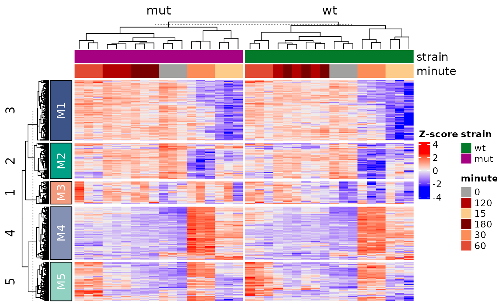
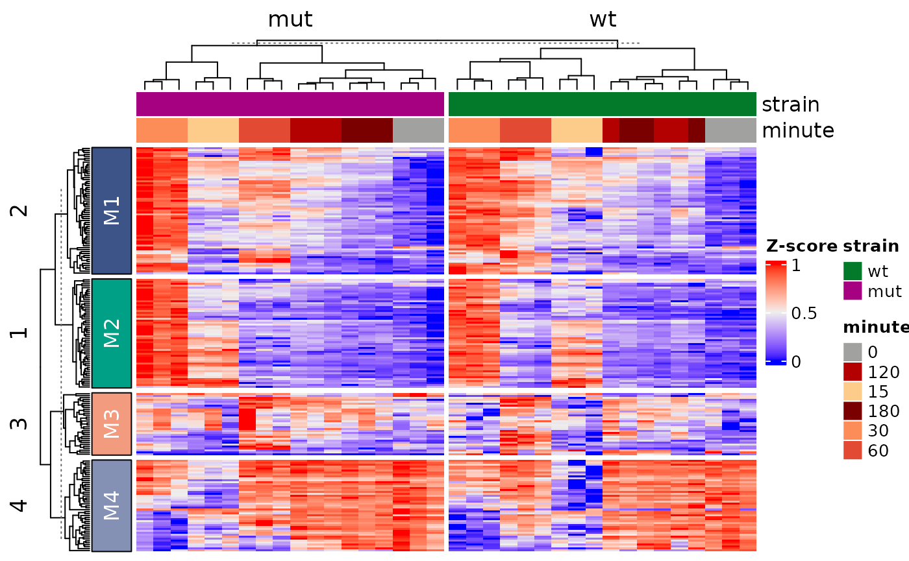
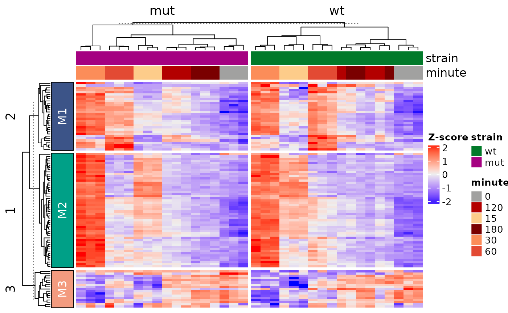

# Getting Started with ADS8192

## Introduction

### ADS8192 provides tools for building annotated gene expression heatmaps from RNA-seq data stored in a SummarizedExperiment.

The workflow includes normalization, feature selection, scaling, heatmap
generation, module extraction, and exporting results.

While the following example is using data from the fission yeast stress
response experiment, the functions are designed to work more generally
on compatible gene expression datasets.

\#Workflow Overview The typical workflow consists of: - normalize count
data - select top variable genes - scale expression matrices - generate
annotated heatmaps - extract gene modules - export results

### Quick Example

``` r
library(ADS8192)

data("example_se", package = "ADS8192")

result <- ADS8192::run_heatmap_analysis(
  se = example_se,
  n_top = 500,
  scale_method = "zscore",
  gene_k = 5,
  column_split_by = "strain"
)
```



``` r

names(result)
#> [1] "heatmap"       "scaled_matrix" "gene_modules"
head(result$gene_modules)
#>            gene module
#> 1 SPAC22A12.17c     M5
#> 2  SPAC23H3.15c     M4
#> 3    SPBC660.05     M4
#> 4  SPBC24C6.09c     M4
#> 5  SPCPB16A4.07     M4
#> 6   SPACUNK4.17     M4
```

### Changing Parameters

``` r
result2 <- run_heatmap_analysis(
  se = example_se,
  n_top = 200,
  scale_method = "minmax",
  gene_k = 4,
  column_split_by = "strain"
)
```



``` r

head(result2$gene_modules)
#>            gene module
#> 1 SPAC22A12.17c     M1
#> 2  SPAC23H3.15c     M1
#> 3    SPBC660.05     M2
#> 4  SPBC24C6.09c     M1
#> 5  SPCPB16A4.07     M2
#> 6   SPACUNK4.17     M1
```

### Exporting Results

``` r
out_dir <- tempdir()

result3 <- run_heatmap_analysis(
  se = example_se,
  n_top = 100,
  scale_method = "zscore",
  gene_k = 3,
  column_split_by = "strain",
  output_dir = out_dir
)
```



``` r

list.files(out_dir, pattern = "\\.tsv$")
#> [1] "gene_modules.tsv"      "module_gene_lists.tsv" "scaled_expression.tsv"
```
